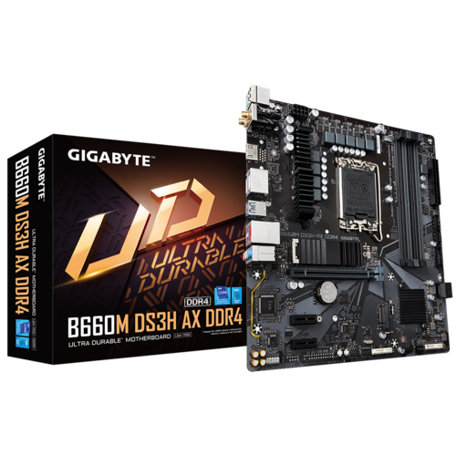
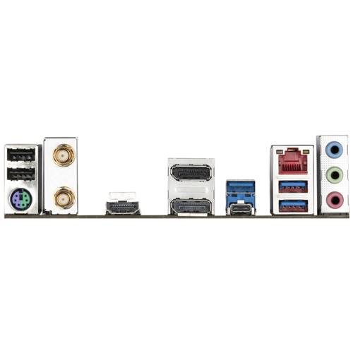
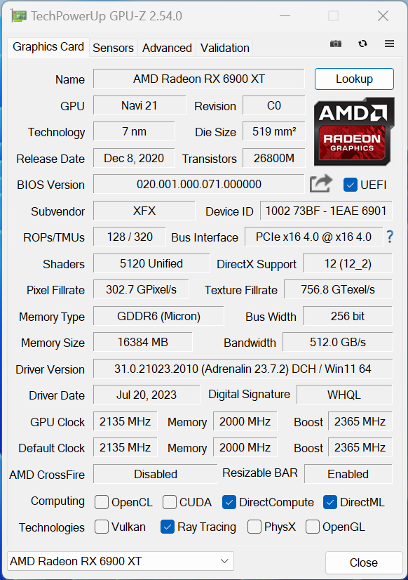

# Hackintosh GIGABYTE B660M DS3H AX DDR4 - i7-12700F

This repository contains the files needed to set up a Hackintosh with the ***GIGABYTE B660M DS3H AX DDR4*** motherboard and Intel ***i7-12700F*** processor. Here you will find everything you need to create a working system with the following features:

Mother board official site: https://www.gigabyte.com/Motherboard/B660M-DS3H-AX-DDR4-rev-1x#kf

***OpenCore: 0.9.3 - Osx Ventura - iMacPro1,1***

[x] Drivers for Windows
  [x] Bluetooth / Wifi

[x] Intel 12th Gen Intel(R) Core i7-12700F
    - Family: 6
    - Model: 151(86h)
    - Stepping 2
    - 2.1Ghz L3 Cache
    [x] Power Management Table

- Ram 16GB DDR4 
- M2 
[x] Hibernate / Sleep

[x] Ati Radeon xr 6900 xt Mec319 (is run native with out wethergreen.kext) fully supported
    [x] HDMI audio
    [x] Power Play Table
[x] PCI on m2, pci-e
[x] Ethernet RTL8125BG
[-] WiFi 6gen ax - RZ608 aka Mediatek MT7921K (BCM94360Z3)

[x] All MotherBoard USB's x7
    [x] usb-c 3.2 gen2
    [x] usb 2.0
    [x] usb 3.0
[x] Inegrated Sound Outputs

# CPU Alder Lake i7-12700F
* https://www.intel.com/content/www/us/en/products/sku/134592/intel-core-i712700f-processor-25m-cache-up-to-4-90-ghz/specifications.html
  
    Total Cores 12
    Total Threads 20

## GPU-Z

### Geekbench 6. 1.0 for Windows AVX2
* GPU Vulcan score: 148459
* CPU Sinale-Core Score: 2354
* CPU Multi-Core Score: 7304

# Download 

You can ***BUY*** the files needed to configure your Hackintosh from the following link [Download Hackintosh](https://ko-fi.com/s/8d36c83052).
Where is an explanation of how to configure and replicate the same hardware configuration.

Enjoy your Hackintosh with GIGABYTE B660M DS3H AX DDR4 motherboard and Intel i7-12700F processor! If you need additional help, feel free to consult the documentation and resources provided in this repository.
